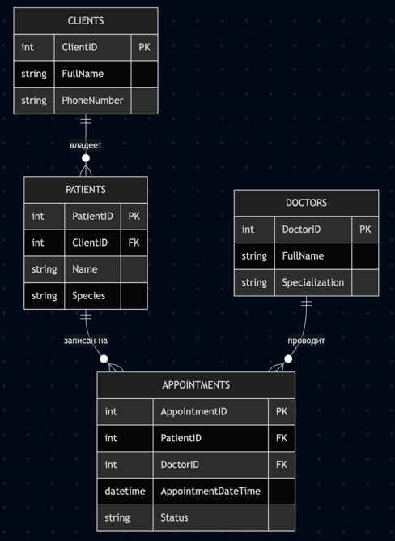

# VetClinicProject
### Проект "Ветеринарная клиника"

Это учебный проект, созданный в рамках тестового задания. Приложение имитирует базовые функции информационной системы для ветеринарной клиники.
### 1. Схема Базы Данных (Database Schema)

Проектирование базы данных основано на реляционной модели с целью обеспечения целостности данных, минимизации избыточности и поддержки свойства соединения без потерь. Были выделены четыре ключевые сущности: `Clients`, `Patients`, `Doctors`, `Appointments`. (Клиенты, Пациенты, Врачи, Визиты)

### ER-диаграмма

Диаграмма отношения сущностей

### Описание таблиц и зависимостей

#### Таблица `Clients` (Клиенты)
Хранит информацию о владельцах животных.

| Поле          | Тип данных  | Описание                 | Ключ/Ограничения     |
|---------------|-------------|--------------------------|----------------------|
| `ClientID`    |INT          | Уникальный ID клиента    | **PK** (Primary Key) |
| `FullName`    | VARCHAR(255) | ФИО клиента              | NOT NULL             |
| `PhoneNumber` | VARCHAR(20) | Контактный номер телефона | NOT NULL             |

#### Таблица `Patients` (Пациенты)
Хранит информацию о питомцах. Связана с таблицей `Clients` отношением "один-ко-многим".

| Поле          | Тип данных   | Описание                 | Ключ/Ограничения |
|---------------|--------------|--------------------------|------------------|
| `PatientID`   | INT          | Уникальный ID пациента   | **PK** (Primary Key) |
| `Name`        | VARCHAR(100) | Кличка питомца           | NOT NULL         |
| `Species`     | VARCHAR(50)  | Вид (кошка, собака)      |                  |
| `Breed`       | VARCHAR(50)  | Порода                   |                  |
| `DateOfBirth` | DATE         | Дата рождения            |                  |
| `ClientID`    | INT          | ID владельца             | **FK** -> Clients(ClientID) |

#### Таблица `Doctors` (Врачи)
Справочник врачей клиники.

| Поле           | Тип данных   | Описание                | Ключ/Ограничения |
|----------------|--------------|-------------------------|------------------|
| `DoctorID`     | INT          | Уникальный ID врача     | **PK** (Primary Key) |
| `FullName`     | VARCHAR(255) | ФИО врача               | NOT NULL         |
| `Specialization` | VARCHAR(100) | Специализация врача     |                  |

#### Таблица `Appointments` (Визиты)
Связующая таблица для реализации связи "многие-ко-многим" между пациентами и врачами. 

| Поле                  | Тип данных  | Описание                     | Ключ/Ограничения |
|-----------------------|-------------|------------------------------|------------------|
| `AppointmentID`       |  INT        | Уникальный ID приема         | **PK** (Primary Key) |
| `PatientID`           | INT         | ID пациента                  | **FK** -> Patients(PatientID) |
| `DoctorID`            | INT         | ID врача                     | **FK** -> Doctors(DoctorID) |
| `AppointmentDateTime` | TIMESTAMP   | Дата и время приема          | NOT NULL         |
| `Status`              | VARCHAR(50) | Статус ('Запланирован', 'Завершен') | NOT NULL         |
| `Diagnosis`           | TEXT        | Поставленный диагноз         |                  |
| `Treatment`           | TEXT        | Назначенное лечение          |                  |

